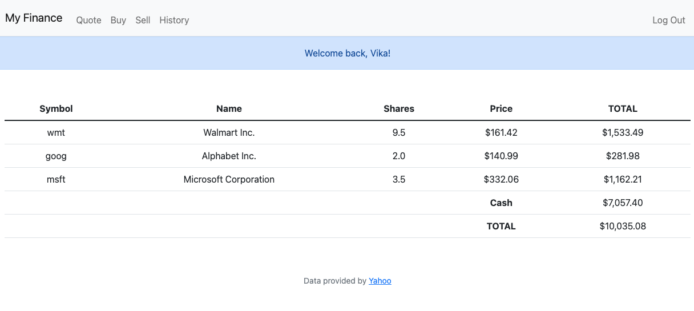
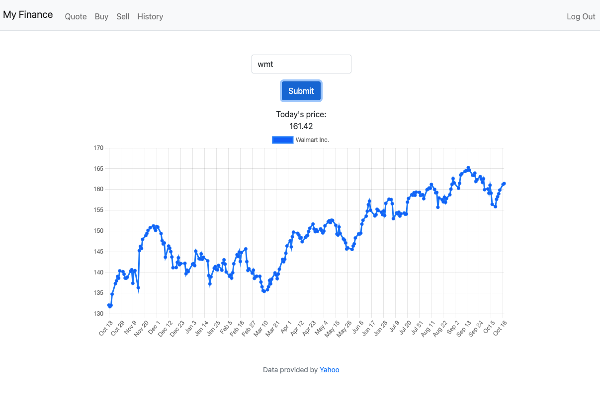
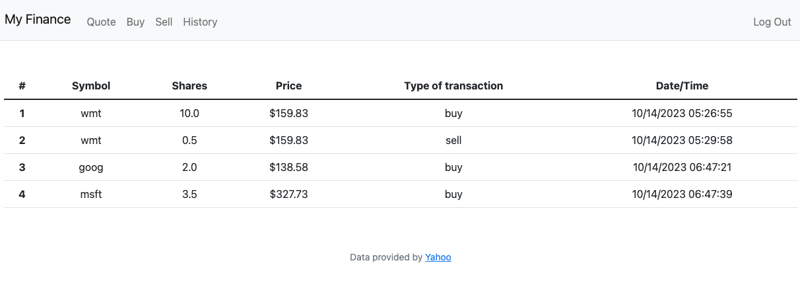

# Trader Simulator
This is a web app that allows you to become a stock trader and practice betting on the market without any risks. Each user gets virtual $10,000 after registration, which they can use to buy and sell stocks and accumulate virtual wealth.


To make run the app use the following commands:

 - create a virtual environment and activate it
```
$ virtualenv env
$ source env/bin/activate
```

- install this projects dependencies listed in requirements.txt
```
$ pip3 install -r requirements.txt
```

- create a database with
```
$ createdb stocks
$ psql stocks < database.sql
```
- run the app
```
$ python3 app.py
```

## Screenshots
Main page that shows your stock portfolio:


Quote page that shows current price and statistics for the past year:


History page that show all transactions:
